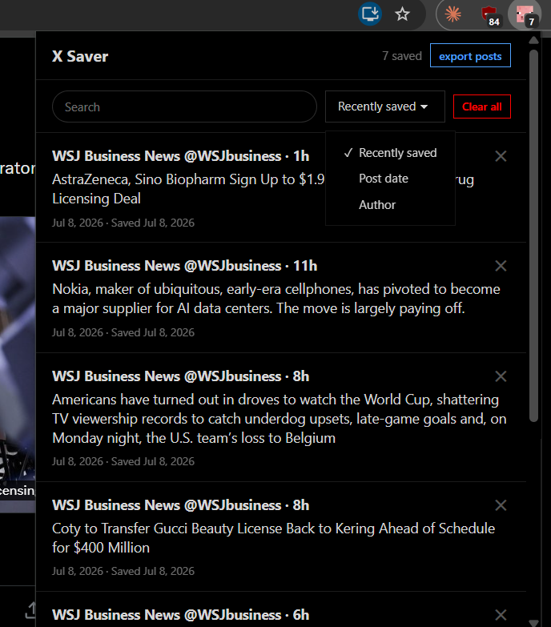
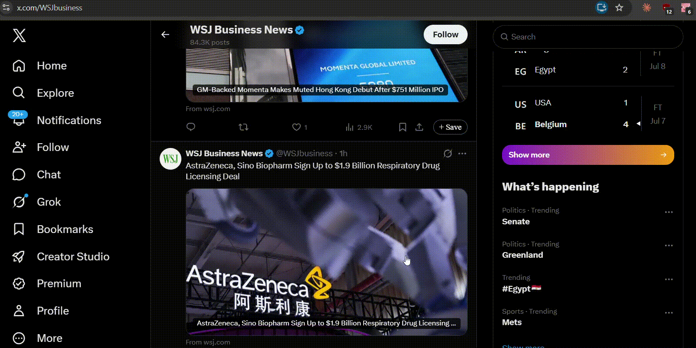

# X Saver

Save and organize posts from X with ease. A lightweight Chrome extension that replaces X's frustrating native bookmarks with post searching, filtering, and data export.

## Why X Saver?

X's native bookmarks are hard to use because there is no search or organization function. To find the post you are looking for, you have to scroll through months of saved posts. X Saver gives users what should've been provided to them all along:

- **No endless scrolling:** Find posts in seconds with a search functionality
- **Smart organization:** Filter posts by author, date posted, or when you saved them
- **Your data stays private:** Posts are kept on your local device only. X doesn't see what you're saving
- **Free & Lightweight:** Minimal impact on your browsing experience

## Features

- Save posts with one click
- Search & filter your collection
- Export to CSV
- Uses local storage so your data stays private
- Post counter badge

## Installation

Download from the [Chrome Web Store](https://chromewebstore.google.com) --> placeholder link for now until i pay the $5

To install from source:
1. Clone this repo
2. Go to `chrome://extensions`
3. Enable "Developer mode" (top right)
4. Click "Load unpacked" and select this folder

## How to Use

1. **Save a post:** While browsing X, click the "+ Save" button below any post. The button will change to "Saved" to confirm.
   
   

2. **View saved posts:** Click the X Saver extension icon to open your collection.
   
   

3. **Search and filter:** Type keywords in the search box to find posts by author or content.

   

4. **Export**: Click "export posts" to download a CSV file of all your saved posts.
   
5. **Delete**: Click the "X" beside any post to remove it, or use "Clear all" to start fresh.

## Privacy & Local Storage

All your saved posts are stored locally on your device using browser storage. This is completely separate from X's native bookmarks. X has no visibility into what you're saving with this extension.

X Saver **does not**:
- Send data to external servers
- Collect analytics or usage data
- Share your posts with anyone
- Sync to your X account

See the full [Privacy Policy](./PRIVACY_POLICY.md) for details.

**Permissions used:**
- `storage`: Save and retrieve your posts locally
- `tabs`: Open saved posts in new tabs when you click them

## Future Plans

- Import existing saved posts from your X account
- Sync saved posts across browsers
- Tagging and collections for better organization
- Optional sync to X bookmarks (while keeping local-only saves as the default)
- Allow users to import custom extension icons

## License

MIT